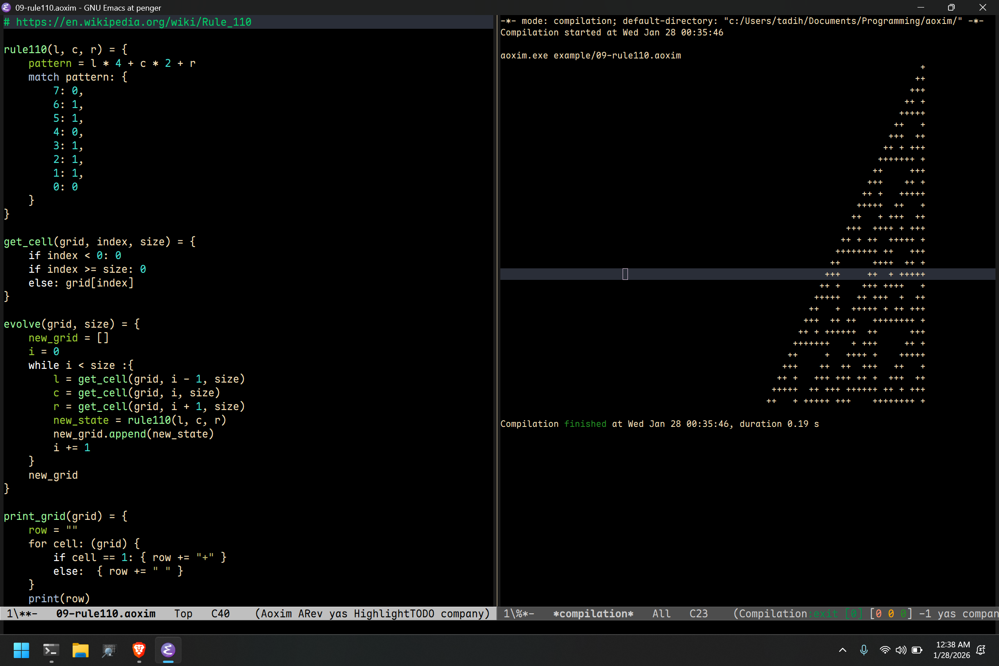

# Aoxim

It is a scipting language that has fully compatibility with C libraries as it has its own FFI and is meant for general use case and system level Programming.

## TODO:
- [ ] Make it statically typed executable language as well.
- [ ] Use Libffi as my FFI does not account for varaidics very well.
- [ ] Add binary operations.

## Use case
All examples are in example but to get started use the following commands for your operating system.

#### Linux/Macos
``` sh
./build.sh
```

#### Windows
``` sh
.\build.bat # Note that u need the Clang compiler.
```

## Fully Turing complete
It is fully turing complete and for those interested about rule110 you can read about it in [RULE110](https://en.wikipedia.org/wiki/Rule_110).


